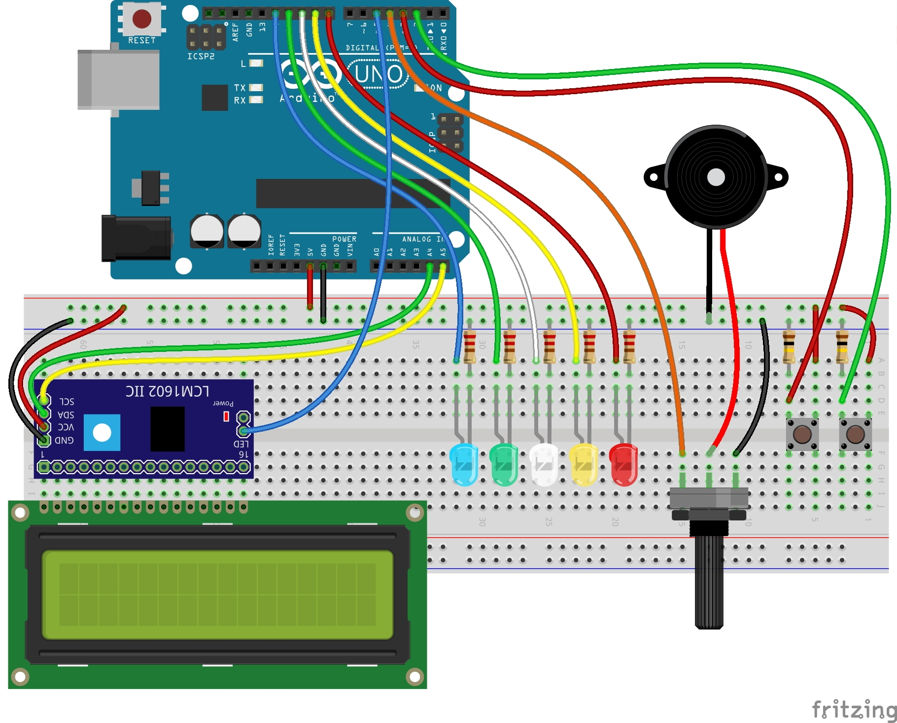

# arduino-natale

## Set the project

Open your Terminal in path of the project and unzip ```LiquidCrystal_I2C.zip``` and ```RtttlPlayer.zip``` in the following way:

```
~/Desktop/arduino-natale $ unzip LiquidCrystal_I2C.zip
~/Desktop/arduino-natale $ unzip RtttlPlayer.zip
```

Now there are two ways to proceed:

1. Move both unzipped folders (```LiquidCrystal_I2C``` and ```RtttlPlayer```) to the following file path:
	```
	.../Documents/Arduino/libraries
	```
	> __NOTE__: This path is valid only for Mac OS users.

2. Instead of copying the unzipped folders you can open ```arduino-natale.ino``` and edit the first two lines from this:

	``` C++
	#include <RtttlPlayer.h>
	#include <LiquidCrystal_I2C.h>

	...
	```
	to this:
	``` C++
	#include "./RtttlPlayer/RtttlPlayer.h"
	#include "./LiquidCrystal_I2C/LiquidCrystal_I2C.h"

	...
	```

## Schema di montaggio

<p align="center">
  
</p>

