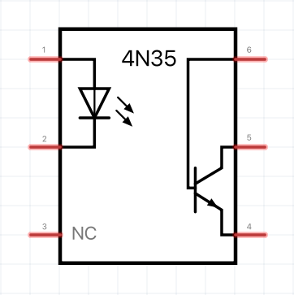
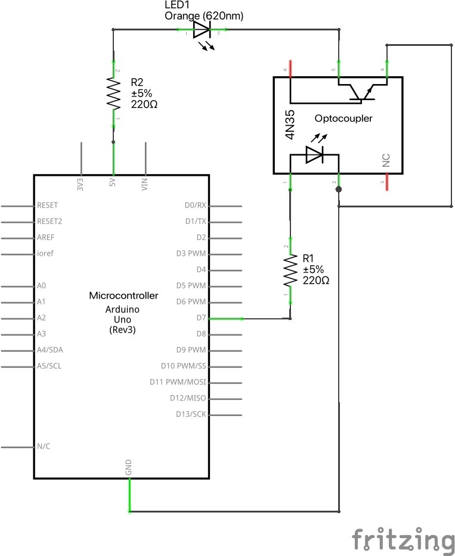
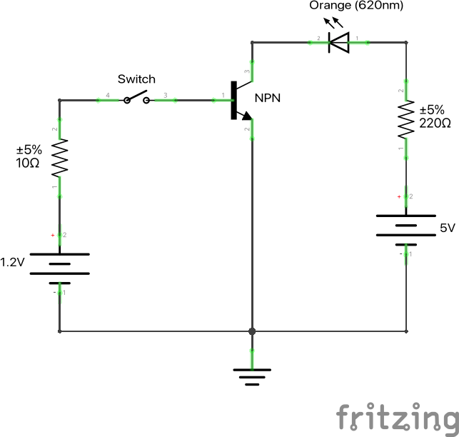
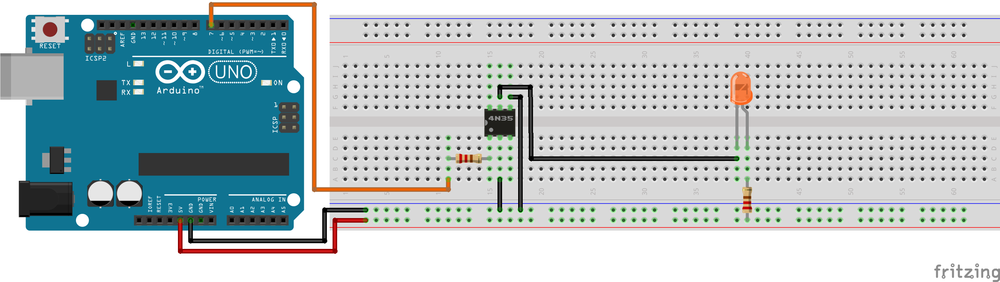

# Hardware Hacking with Arduino

The interesting thing about this project is that it has a really broad scope of application in which you have to have a perfect understanding of electronics, how individual electronic components work, and especially what happens if these electronic components are all put together in one circuit, which is exactly what we will see in a moment.

I don't want to go on too long so it is with immense pleasure that I introduce the [optocoupler](https://en.wikipedia.org/wiki/Opto-isolator)!

<p align="center">
    
</p>

For those who do not feel like reading the entire Wikipedia description very simply the optocoupler is an electronic component that allows a signal to be transferred between two circuits while maintaining galvanic isolation between them.

It is normally made by optically coupling an LED with a photosensitive element. Changes in brightness related to the input signal are detected by the photosensitive element, achieving the transfer of information from one circuit to the other without electrical continuity. Optoisolators are used in all cases where, for safety reasons or circuit needs, it is necessary to keep two circuits electrically separated, for example in the case of power control systems, in the input circuits of PLCs, in some types of switching power supplies.

The bandwidth of optoisolators ranges from DC to several $\text{MHz}$. Insulation is normally in the range of $1500V$, but there are models that can withstand much higher voltages. The photosensitive element can be of various types. In most cases a phototransistor is used, but there are optoisolators that use photodiodes, phototriacs, and rarely photoresistors. In some cases a circuit may also be integrated to process the signal, for example, an operational amplifier or a [Schmitt trigger](https://en.wikipedia.org/wiki/Schmitt_trigger).

Ok all very nice but how do we use this great component for hardware hacking? There is no one answer to this question because, as I said at the beginning, there are so many fields of application, and what we are going to look at today represents only a small example of an application, which, however, is more than enough to make one understand the power of the optocoupler!

In particular, we consider the following wiring diagram:

<p align="center">
    
</p>

So through the Arduino UNO microcontroller we will go to control the optocoupler which in turn, thanks to its internal circuitry composed of a led diode and a phototransistor, will control the led diode (Orange 620nm) present on a circuitry external to our main circuit! I know that from the schematic it seems that the led diode (Orange 620nm) is part of the same circuit but it is not, in fact it is only connected to the $5V$ power supply of the Arduino through the anode, while the cathode is connected to the collector of the phototransistor , i.e. to one of the two optocoupler output terminals that are used to hack the external circuits!

I also point out that the phototransistor emitter is connected to ground, so the latter acts like a switch. This means that we can approximate the entire optocoupler circuitry with the following wiring diagram:

<p align="center">
    
</p>

In particular, the led diode inside the optocoupler, as we know, can be approximated by a voltage generator equal to $1.2V$ with a resistance $R$ in series with values ​​ranging from a few tens of ohms to a few hundreds of ohms. The switch represents the Arduino microcontroller code which through the ```digitalWrite(OPTOCOUPLER_PIN, state ? HIGH : LOW);``` instruction allows current to pass or not inside the led diode which in turn generates a base current $I_B$ for the base terminal of the phototransistor which in turn thanks to the collector, given that the phototransistor acts as a switch, it carries the current to the LED diode (Orange 620nm) thus allowing its ignition as it is directly polarized.

>**NOTE:** you can use the [Every Circuit](https://everycircuit.com/) software available for both IOS and Android (but also for computers) to simulate this approximate circuit in order to convince yourself of what I'm saying!

Finally, the assembly diagram is as follows:

<p align="center">
    
</p>

>**NOTE:** all schematics are present in the ```fritzing/``` directory